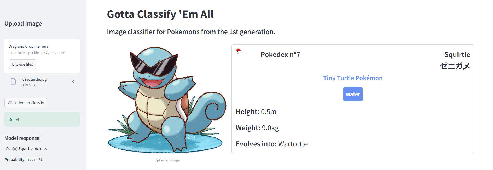

# GottaClassifyEmAll


This repository contains a script to fine-tune a transformer encoder model for Pokemon images classification. The model is based on [Vision Transformer (VIT)](https://huggingface.co/google/vit-base-patch16-224-in21k) and has been fine-tuned on [1st Generation Pokemon images](https://huggingface.co/datasets/Dusduo/1stGen-Pokemon-Images).

The final model is able to discriminate between the pokemons from the [1st Generation](https://en.wikipedia.org/wiki/List_of_generation_I_Pok%C3%A9mon). And tell when the provided images are not pokemons, or at least when it is unable to recognize them (e.g. pokemons from posterior generations).

## Usage

1. Clone this repository:

   ```bash
   git clone https://github.com/A-Duss/GottaClassifyEmAll.git
   cd GottaClassifyEmAll
   ```

2. Install the required packages:

   ```bash
   pip install -r requirements.txt
   ```

### Use the already fine-tuned model 

You can use my fine-tuned model hosted on Hugging Face Model Hub: [Dusduo/Pokemon-classification-1stGen](https://huggingface.co/Dusduo/Pokemon-classification-1stGen), by running the `predict.py` as in the following code:

```bash
python predict.py --img_path=./data/sample_imgs/01abra.jpg --load_from_hf
```
Change the `--img_path` value to correspond to the path of the image you want to classify.

### Fine-tune the model yourself:

Fine-tune the model by running the `train.py` script.

```bash
python train.py
```

After fine-tuning, the model can be used to classify images by running `predict.py` in the following fashion:

```bash
python predict.py --img_path=./data/sample_imgs/01abra.jpg
```
Change the `--img_path` value to correspond to the path of the image you want to classify.

## Pre-trained Model

- Pre-trained model: [google/vit-base-patch16-224-in21k](https://huggingface.co/google/vit-base-patch16-224-in21k)

## Fine-Tuning Dataset

- Fine-tuning dataset: [Dusduo/1stGen-Pokemon-Images](https://huggingface.co/datasets/Dusduo/1stGen-Pokemon-Images)

## Model

You can find my final fine-tuned model on Hugging Face Model Hub: [Dusduo/Pokemon-classification-1stGen](https://huggingface.co/Dusduo/Pokemon-classification-1stGen)

It achieves the following results on the evaluation set:
- Loss: 0.4182
- F1: 0.9272

Feel free to try it out on my [demo hosted on Spaces](https://huggingface.co/spaces/Dusduo/GottaClassifyEmAll)!



